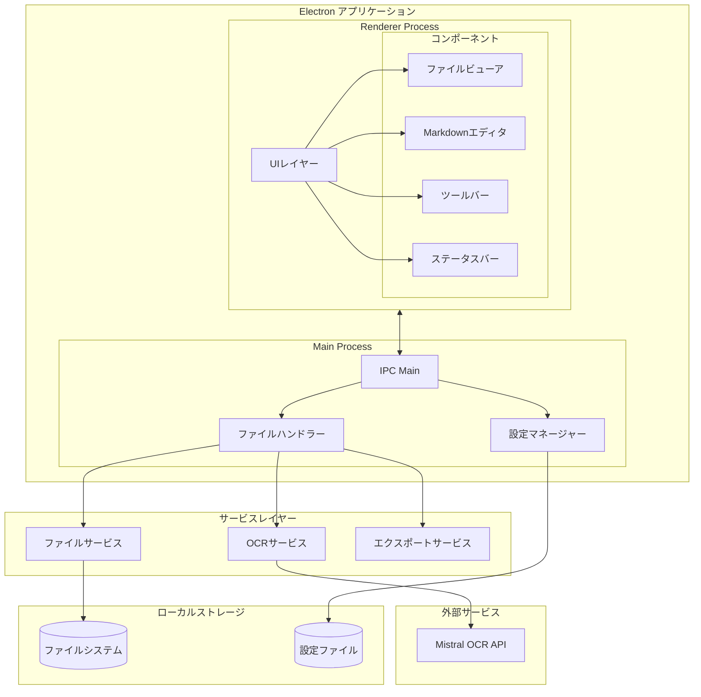
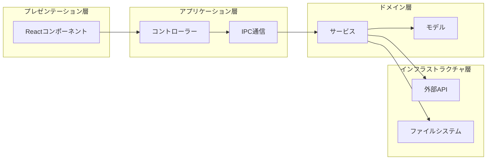
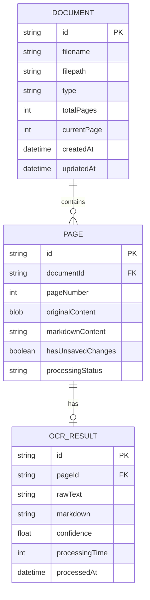
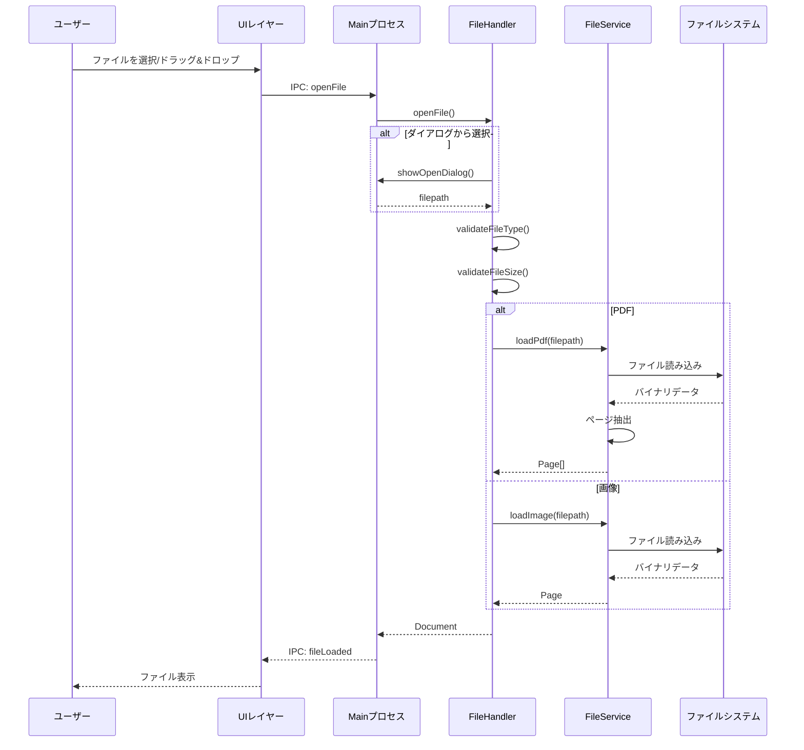
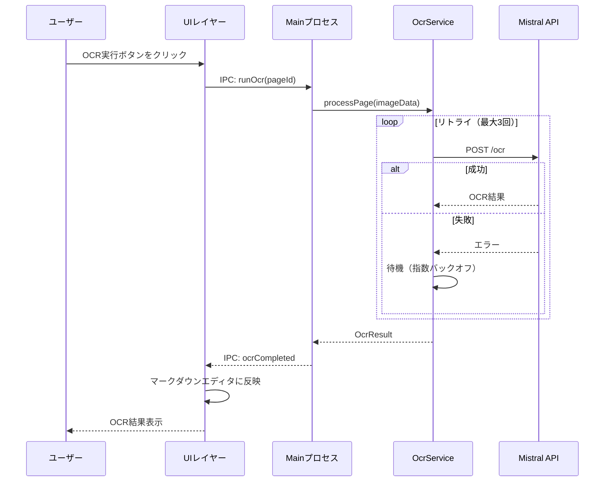
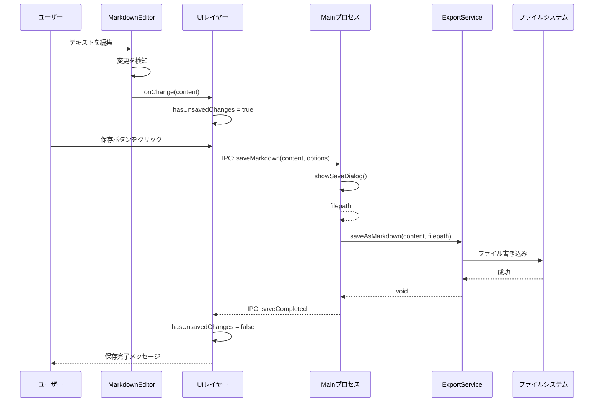
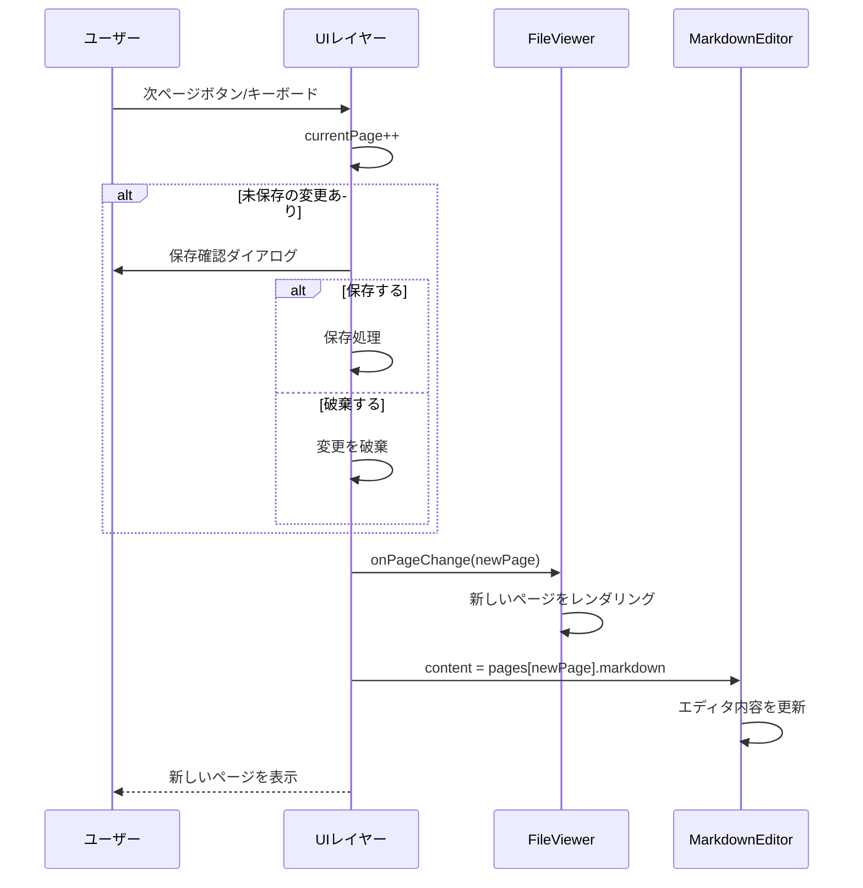
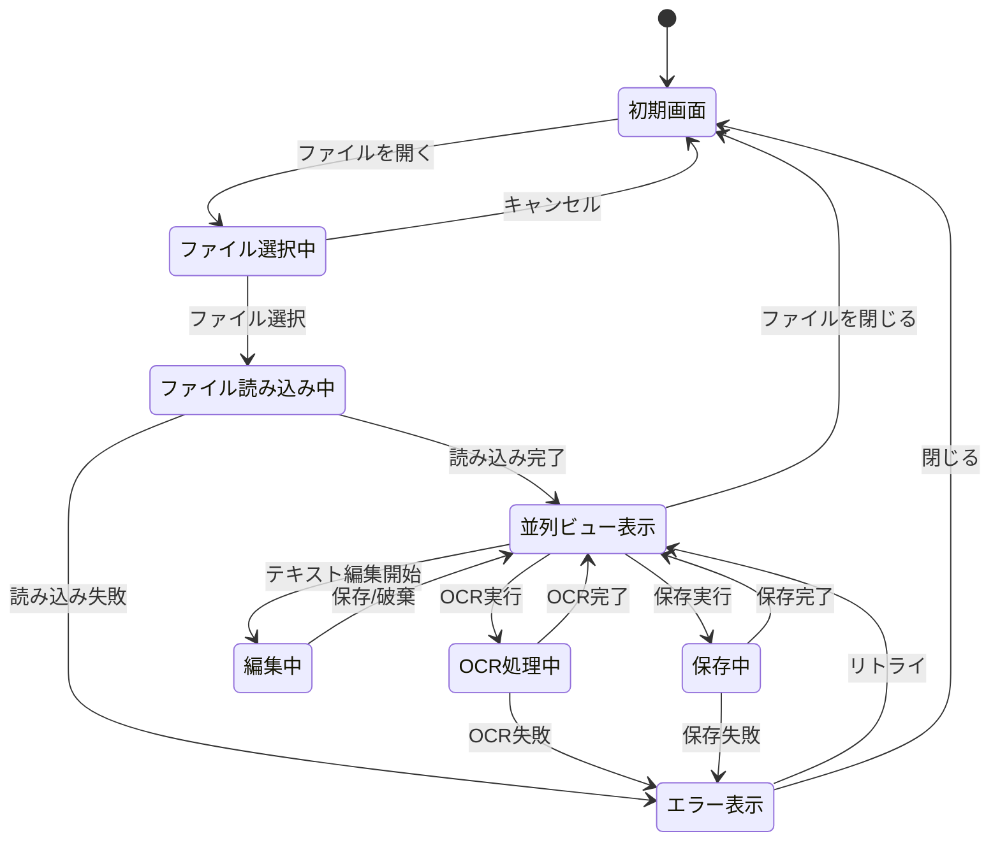

# 機能設計書 (Functional Design Document)

本ドキュメントは、DocFlowアプリケーションの機能設計を定義します。
プロダクト要求定義書(PRD)に基づき、「どう実現するか」を詳細化しています。

## システム構成図

### 全体アーキテクチャ



### レイヤー構成



## 技術スタック

| 分類 | 技術 | 選定理由 |
|------|------|----------|
| デスクトップフレームワーク | Electron 39.0.0 | クロスプラットフォーム対応、Web技術での開発が可能 |
| ランタイム | Node.js v24.12.0 | LTS版、Electronとの互換性 |
| 言語 | TypeScript 5.x | 型安全性、開発効率の向上 |
| UIライブラリ | React 18.x | コンポーネント指向、豊富なエコシステム |
| PDFレンダリング | PDF.js | Mozillaの信頼性、ブラウザ互換 |
| Markdownエディタ | CodeMirror 6 | 高性能、拡張性、シンタックスハイライト |
| OCR API | Mistral OCR | 高精度、マークダウン出力対応 |
| テスト | Vitest 2.x | 高速、TypeScript対応 |

## データモデル定義

### コアエンティティ

#### Document (処理対象ドキュメント)

```typescript
interface Document {
  id: string;                    // UUID v4
  filename: string;              // 元ファイル名
  filepath: string;              // 元ファイルパス
  type: DocumentType;            // 'pdf' | 'image'
  totalPages: number;            // 総ページ数（画像の場合は1）
  currentPage: number;           // 現在表示中のページ
  createdAt: Date;               // 読み込み日時
  updatedAt: Date;               // 最終更新日時
}

type DocumentType = 'pdf' | 'image';
```

#### Page (ページ単位のデータ)

```typescript
interface Page {
  id: string;                    // UUID v4
  documentId: string;            // 親ドキュメントID
  pageNumber: number;            // ページ番号（1始まり）
  originalContent: Uint8Array;   // 元ファイルのバイナリデータ
  ocrResult?: OcrResult;         // OCR処理結果
  markdownContent: string;       // 編集中のマークダウン
  hasUnsavedChanges: boolean;    // 未保存の変更があるか
  processingStatus: ProcessingStatus;  // 処理状態
}

type ProcessingStatus = 'pending' | 'processing' | 'completed' | 'error';
```

#### OcrResult (OCR処理結果)

```typescript
interface OcrResult {
  id: string;                    // UUID v4
  pageId: string;                // 対象ページID
  rawText: string;               // OCRで抽出された生テキスト
  markdown: string;              // マークダウン形式のテキスト
  confidence: number;            // 認識信頼度（0-1）
  processingTime: number;        // 処理時間（ミリ秒）
  processedAt: Date;             // 処理日時
}
```

#### AppConfig (アプリケーション設定)

```typescript
interface AppConfig {
  mistralApiKey: string;         // Mistral APIキー（暗号化して保存）
  defaultSavePath: string;       // デフォルト保存先
  autoSaveEnabled: boolean;      // 自動保存の有効/無効
  autoSaveInterval: number;      // 自動保存間隔（秒）
  viewerSettings: ViewerSettings;
  editorSettings: EditorSettings;
}

interface ViewerSettings {
  defaultZoom: number;           // デフォルト表示倍率
  splitRatio: number;            // 左右ペインの分割比率（0-1）
}

interface EditorSettings {
  fontSize: number;              // フォントサイズ
  lineNumbers: boolean;          // 行番号表示
  wordWrap: boolean;             // 折り返し表示
}
```

### ER図



## コンポーネント設計

### Mainプロセス

#### FileHandler

**責務**:
- ファイルの読み込み・保存処理
- ファイルダイアログの制御
- ドラッグ&ドロップの処理

```typescript
class FileHandler {
  // ファイルを開く（ダイアログ表示）
  async openFile(): Promise<Document | null>;

  // 指定パスのファイルを読み込む
  async loadFile(filepath: string): Promise<Document>;

  // マークダウンを保存
  async saveMarkdown(
    content: string,
    filepath: string,
    metadata?: DocumentMetadata
  ): Promise<void>;

  // ファイル形式を検証
  validateFileType(filepath: string): boolean;

  // ファイルサイズを検証
  validateFileSize(filepath: string): boolean;
}
```

**依存関係**:
- Electron Dialog API
- FileService

#### ConfigManager

**責務**:
- アプリケーション設定の読み込み・保存
- APIキーの暗号化/復号化

```typescript
class ConfigManager {
  // 設定を読み込む
  loadConfig(): AppConfig;

  // 設定を保存する
  saveConfig(config: AppConfig): void;

  // APIキーを取得（復号化）
  getApiKey(): string;

  // APIキーを保存（暗号化）
  setApiKey(key: string): void;
}
```

**依存関係**:
- Electron safeStorage API
- ファイルシステム

### Rendererプロセス

#### FileViewer

**責務**:
- PDF/画像の表示
- ズーム制御
- ページナビゲーション

```typescript
interface FileViewerProps {
  document: Document;
  currentPage: number;
  zoomLevel: number;
  onPageChange: (page: number) => void;
  onZoomChange: (zoom: number) => void;
}

class FileViewer extends React.Component<FileViewerProps> {
  // PDFページをレンダリング
  private renderPdfPage(pageNumber: number): void;

  // 画像を表示
  private renderImage(): void;

  // ズームを適用
  private applyZoom(level: number): void;
}
```

**依存関係**:
- PDF.js
- React

#### MarkdownEditor

**責務**:
- マークダウンテキストの編集
- シンタックスハイライト
- 編集履歴管理（Undo/Redo）

```typescript
interface MarkdownEditorProps {
  content: string;
  onChange: (content: string) => void;
  onSave: () => void;
  hasUnsavedChanges: boolean;
}

class MarkdownEditor extends React.Component<MarkdownEditorProps> {
  // コンテンツを更新
  private handleChange(content: string): void;

  // 元に戻す
  undo(): void;

  // やり直し
  redo(): void;

  // 変更を破棄
  discardChanges(): void;
}
```

**依存関係**:
- CodeMirror 6
- @codemirror/lang-markdown

#### Toolbar

**責務**:
- 操作ボタンの表示
- ユーザーアクションのディスパッチ

```typescript
interface ToolbarProps {
  onOpenFile: () => void;
  onSave: () => void;
  onRunOcr: () => void;
  onZoomIn: () => void;
  onZoomOut: () => void;
  isProcessing: boolean;
  hasDocument: boolean;
}
```

#### StatusBar

**責務**:
- 処理状態の表示
- ページ情報の表示
- エラー通知

```typescript
interface StatusBarProps {
  currentPage: number;
  totalPages: number;
  processingStatus: ProcessingStatus;
  processingProgress?: number;  // 0-100
  errorMessage?: string;
}
```

### サービスレイヤー

#### OcrService

**責務**:
- Mistral OCR APIとの通信
- OCR処理の実行とエラーハンドリング
- リトライ処理

```typescript
class OcrService {
  constructor(private apiKey: string);

  // 単一ページのOCR処理
  async processPage(imageData: Uint8Array): Promise<OcrResult>;

  // 複数ページのOCR処理（バッチ）
  async processPages(
    pages: Page[],
    onProgress?: (current: number, total: number) => void
  ): Promise<OcrResult[]>;

  // APIキーの有効性を検証
  async validateApiKey(): Promise<boolean>;
}
```

**エラーハンドリング**:
- ネットワークエラー: 3回までリトライ（指数バックオフ）
- APIレート制限: 待機後リトライ
- 認証エラー: ユーザーに通知、設定画面へ誘導

#### FileService

**責務**:
- PDFの読み込みとページ抽出
- 画像ファイルの読み込み
- ファイル検証

```typescript
class FileService {
  // PDFを読み込みページを抽出
  async loadPdf(filepath: string): Promise<Page[]>;

  // 画像を読み込み
  async loadImage(filepath: string): Promise<Page>;

  // 複数画像を読み込み
  async loadImages(filepaths: string[]): Promise<Page[]>;

  // ファイル形式を判定
  getFileType(filepath: string): DocumentType | null;
}
```

#### ExportService

**責務**:
- マークダウンファイルの生成
- メタデータの埋め込み

```typescript
class ExportService {
  // マークダウンをファイルに保存
  async saveAsMarkdown(
    content: string,
    filepath: string,
    options?: ExportOptions
  ): Promise<void>;

  // 全ページを1ファイルにまとめて保存
  async saveAllPages(
    pages: Page[],
    filepath: string,
    options?: ExportOptions
  ): Promise<void>;
}

interface ExportOptions {
  includeMetadata: boolean;      // メタデータを含めるか
  originalFilePath?: string;     // 元ファイルパス
}
```

## ユースケース図

### UC1: ファイル読み込み



### UC2: OCR処理



### UC3: マークダウン編集と保存



### UC4: ページナビゲーション



## 画面遷移図



## UI設計

### メインウィンドウレイアウト

```
┌─────────────────────────────────────────────────────────────────────────────┐
│ ツールバー                                                                   │
│ [ファイルを開く] [保存] [OCR実行] │ [ズーム: 100% ▼] │ [設定]               │
├─────────────────────────────────────────────────────────────────────────────┤
│                           │                                                 │
│   ファイルビューア          │   マークダウンエディタ                          │
│   (PDF/画像表示)           │   (テキスト編集)                                │
│                           │                                                 │
│   ┌─────────────────┐     │   ```markdown                                   │
│   │                 │     │   # 見出し                                      │
│   │   [ページ内容]   │     │                                                 │
│   │                 │     │   本文テキスト...                               │
│   │                 │     │   ```                                           │
│   └─────────────────┘     │                                                 │
│                           │                                                 │
│   [◀ 前] [3/10] [次 ▶]    │                                                 │
│                           │                                                 │
├─────────────────────────────────────────────────────────────────────────────┤
│ ステータスバー: 処理中... 50%  │  3/10ページ  │  未保存の変更あり             │
└─────────────────────────────────────────────────────────────────────────────┘
```

### カラースキーム

| 要素 | 色 | 用途 |
|------|-----|------|
| プライマリ | #2563eb | ボタン、リンク |
| 成功 | #16a34a | 完了メッセージ |
| 警告 | #ca8a04 | 未保存の警告 |
| エラー | #dc2626 | エラーメッセージ |
| 背景 | #f8fafc | メイン背景 |
| テキスト | #1e293b | 通常テキスト |

### キーボードショートカット

| 操作 | ショートカット | 説明 |
|------|---------------|------|
| ファイルを開く | Ctrl/Cmd + O | ファイル選択ダイアログを表示 |
| 保存 | Ctrl/Cmd + S | 現在のページを保存 |
| 全て保存 | Ctrl/Cmd + Shift + S | 全ページを保存 |
| OCR実行 | Ctrl/Cmd + Enter | 現在のページのOCR処理を実行 |
| 次のページ | PageDown / → | 次のページへ移動 |
| 前のページ | PageUp / ← | 前のページへ移動 |
| 元に戻す | Ctrl/Cmd + Z | 編集を元に戻す |
| やり直し | Ctrl/Cmd + Shift + Z | 元に戻した編集をやり直す |
| ズームイン | Ctrl/Cmd + + | 表示を拡大 |
| ズームアウト | Ctrl/Cmd + - | 表示を縮小 |

## エラーハンドリング

### エラーの分類

| エラー種別 | 処理 | ユーザーへの表示 |
|-----------|------|-----------------|
| ファイル形式エラー | 処理を中断 | 「サポートされていないファイル形式です。PDF、JPEG、PNG形式のファイルを選択してください。」 |
| ファイルサイズエラー | 処理を中断 | 「ファイルサイズが上限(100MB)を超えています。」 |
| APIキー未設定 | 設定画面へ誘導 | 「APIキーが設定されていません。設定画面でMistral APIキーを入力してください。」 |
| APIキー無効 | 設定画面へ誘導 | 「APIキーが無効です。正しいAPIキーを入力してください。」 |
| ネットワークエラー | リトライ後に通知 | 「ネットワークエラーが発生しました。インターネット接続を確認してください。」 |
| OCR処理エラー | リトライ後に通知 | 「OCR処理に失敗しました。再度お試しください。」 |
| 保存エラー | リトライ可能 | 「ファイルの保存に失敗しました。保存先を確認してください。」 |

### リトライ戦略

```typescript
interface RetryConfig {
  maxRetries: number;           // 最大リトライ回数: 3
  initialDelayMs: number;       // 初期待機時間: 1000ms
  maxDelayMs: number;           // 最大待機時間: 10000ms
  backoffMultiplier: number;    // 待機時間の増加倍率: 2
}

// 指数バックオフ計算
function calculateDelay(attempt: number, config: RetryConfig): number {
  const delay = config.initialDelayMs * Math.pow(config.backoffMultiplier, attempt);
  return Math.min(delay, config.maxDelayMs);
}
```

## パフォーマンス最適化

### PDF処理

- **遅延読み込み**: 表示中のページのみレンダリング
- **プリフェッチ**: 前後2ページを事前読み込み
- **キャッシュ**: レンダリング済みページをメモリキャッシュ

### メモリ管理

- **メモリ上限**: 1GB以内に収める
- **ページアンロード**: 表示から離れたページはメモリから解放
- **大きなPDF対応**: ストリーミング読み込み

### OCR処理

- **並列処理**: 最大3ページを同時処理
- **進捗表示**: 処理中のページ番号と全体進捗率を表示
- **キャンセル可能**: 処理中断機能

## セキュリティ考慮事項

### APIキーの保護

- **暗号化保存**: Electron safeStorage APIで暗号化
- **メモリ上の保護**: 使用後にメモリをクリア
- **ログ出力禁止**: APIキーをログに出力しない

### ローカル処理

- **データ送信制限**: OCR処理以外はローカルで完結
- **ファイルアップロードなし**: 元ファイルをクラウドに送信しない

### 入力検証

- **ファイル検証**: 形式、サイズ、整合性をチェック
- **パス検証**: パストラバーサル攻撃を防止

## テスト戦略

### ユニットテスト

- **OcrService**: API呼び出し、リトライロジック、エラーハンドリング
- **FileService**: ファイル読み込み、形式判定、ページ抽出
- **ExportService**: マークダウン生成、メタデータ埋め込み
- **ConfigManager**: 設定読み書き、暗号化/復号化

### 統合テスト

- **ファイル読み込みからOCR処理まで**: 一連のフロー
- **編集から保存まで**: データの整合性
- **IPC通信**: Main-Renderer間の通信

### E2Eテスト

- **基本フロー**: ファイル読み込み → OCR → 編集 → 保存
- **ページナビゲーション**: 複数ページのPDFでの操作
- **エラーケース**: ネットワークエラー時の動作
