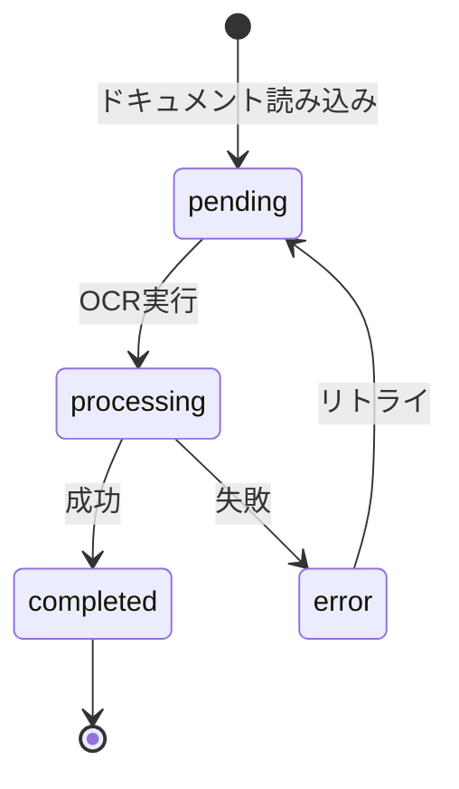

# プロジェクト用語集 (Glossary)

## 概要

このドキュメントは、DocFlowプロジェクト内で使用される用語の定義を管理します。
チーム全体で用語の統一を図り、コミュニケーションの効率化と誤解の防止を目的とします。

**更新日**: 2025-01-10

## ドメイン用語

プロジェクト固有のビジネス概念や機能に関する用語。

### ドキュメント (Document)

**定義**: DocFlowで処理対象となるPDFファイルまたは画像ファイルの総称

**説明**: ユーザーがOCR処理のために読み込むファイル。PDFの場合は複数ページ、画像の場合は単一ページとして扱う。

**関連用語**: ページ、ファイル入力

**使用例**:
- 「ドキュメントを読み込む」
- 「ドキュメントのOCR処理を実行する」

**英語表記**: Document

### ページ (Page)

**定義**: ドキュメント内の1単位。PDFの1ページ、または1枚の画像を指す

**説明**: OCR処理の最小単位。各ページには元データとOCR結果、編集中のマークダウンが紐づく。

**関連用語**: ドキュメント、OCR結果

**使用例**:
- 「3ページ目のOCR結果を確認する」
- 「次のページに移動する」

**英語表記**: Page

### 並列ビューア (Parallel Viewer)

**定義**: 元ファイルとOCR結果を左右に並べて表示する画面レイアウト

**説明**: DocFlowの主要UIコンポーネント。左ペインに元ファイル（PDF/画像）、右ペインにOCR結果（マークダウン）を表示し、同時に確認・編集できる。

**関連用語**: ファイルビューア、マークダウンエディタ

**使用例**:
- 「並列ビューアで元文書とOCR結果を比較する」

**英語表記**: Parallel Viewer / Side-by-side Viewer

### OCR結果 (OCR Result)

**定義**: Mistral OCR APIによるテキスト抽出の結果データ

**説明**: 抽出されたテキスト、マークダウン形式のテキスト、認識信頼度、処理時間などを含む。

**関連用語**: OCR処理、マークダウン

**使用例**:
- 「OCR結果をエディタに反映する」
- 「OCR結果の信頼度が低い箇所を確認する」

**英語表記**: OCR Result

### マークダウン (Markdown)

**定義**: DocFlowでOCR結果の出力形式として使用する軽量マークアップ言語

**説明**: AI処理に適した構造化テキスト形式。見出し、リスト、表などの構造を記述できる。

**関連用語**: OCR結果、エクスポート

**使用例**:
- 「マークダウン形式で保存する」
- 「マークダウンの構造を整形する」

**英語表記**: Markdown

### 自動保存 (Auto Save)

**定義**: 編集中のデータを定期的に自動で保存する機能

**説明**: アプリケーションのクラッシュや予期しない終了からデータを保護する。デフォルトで30秒間隔。

**関連用語**: 復元、未保存の変更

**使用例**:
- 「自動保存が有効になっている」
- 「自動保存されたデータから復元する」

**英語表記**: Auto Save

## 技術用語

プロジェクトで使用している技術・フレームワーク・ツールに関する用語。

### Electron

**定義**: クロスプラットフォームのデスクトップアプリケーションを構築するためのフレームワーク

**公式サイト**: https://www.electronjs.org/

**本プロジェクトでの用途**: DocFlowのデスクトップアプリケーション基盤として使用

**バージョン**: 39.0.0

**関連ドキュメント**: [architecture.md](architecture.md)

### Mistral OCR API

**定義**: Mistral AIが提供するクラウドベースのOCRサービス

**公式サイト**: https://mistral.ai/

**本プロジェクトでの用途**: PDF・画像からテキストを抽出し、マークダウン形式で出力

**バージョン**: mistral-ocr-latest（最新モデル）

**関連ドキュメント**: [functional-design.md](functional-design.md)

### PDF.js

**定義**: MozillaによるJavaScript製のPDFレンダリングライブラリ

**公式サイト**: https://mozilla.github.io/pdf.js/

**本プロジェクトでの用途**: 並列ビューアの左ペインでPDFファイルを表示

**バージョン**: 4.x

**関連ドキュメント**: [architecture.md](architecture.md)

### CodeMirror

**定義**: 高性能なコードエディタを構築するためのライブラリ

**公式サイト**: https://codemirror.net/

**本プロジェクトでの用途**: マークダウンエディタの基盤として使用。シンタックスハイライト、編集履歴を提供

**バージョン**: 6.x

**関連ドキュメント**: [functional-design.md](functional-design.md)

### Vitest

**定義**: Viteベースの高速なテストフレームワーク

**公式サイト**: https://vitest.dev/

**本プロジェクトでの用途**: ユニットテスト、統合テストの実行

**バージョン**: 2.x

**関連ドキュメント**: [development-guidelines.md](development-guidelines.md)

## 略語・頭字語

### OCR

**正式名称**: Optical Character Recognition

**意味**: 光学文字認識。画像やスキャンされたドキュメントからテキストを抽出する技術

**本プロジェクトでの使用**: Mistral OCR APIを使用してPDF/画像からテキストを抽出

### IPC

**正式名称**: Inter-Process Communication

**意味**: プロセス間通信。ElectronのMain-Renderer間でデータをやり取りする仕組み

**本プロジェクトでの使用**: ファイル操作、OCR処理、設定管理などでMain-Renderer間の通信に使用

### API

**正式名称**: Application Programming Interface

**意味**: アプリケーション間の通信インターフェース

**本プロジェクトでの使用**: Mistral OCR API、Preload API

### MVP

**正式名称**: Minimum Viable Product

**意味**: 最小限の機能を持つ製品。必要最低限の機能でリリース可能な状態

**本プロジェクトでの使用**: PRDにおける優先度P0の機能群

### PRD

**正式名称**: Product Requirements Document

**意味**: プロダクト要求定義書。製品の要件を定義するドキュメント

**本プロジェクトでの使用**: [product-requirements.md](product-requirements.md)

## アーキテクチャ用語

システム設計・アーキテクチャに関する用語。

### Mainプロセス (Main Process)

**定義**: ElectronアプリケーションのNode.js側プロセス

**本プロジェクトでの適用**: ファイルシステムアクセス、外部API通信、ネイティブダイアログ表示を担当

**関連コンポーネント**: FileHandler, OcrService, ConfigManager

**図解**:
```
Main Process
├── File Operations (fs)
├── External API (Mistral)
├── Native Dialogs
└── IPC Handler
```

### Rendererプロセス (Renderer Process)

**定義**: ElectronアプリケーションのChromium側プロセス（ブラウザ相当）

**本プロジェクトでの適用**: React UIのレンダリング、ユーザーインタラクションを担当

**関連コンポーネント**: FileViewer, MarkdownEditor, Toolbar, StatusBar

**図解**:
```
Renderer Process
├── React Application
│   ├── FileViewer
│   ├── MarkdownEditor
│   └── UI Components
└── State Management
```

### Preloadスクリプト (Preload Script)

**定義**: Main-Renderer間のセキュアな通信を仲介するスクリプト

**本プロジェクトでの適用**: contextBridgeを使用してRendererに安全なAPIを公開

**関連コンポーネント**: fileApi, ocrApi, configApi

### レイヤードアーキテクチャ (Layered Architecture)

**定義**: 責務ごとに分離されたレイヤーで構成するアーキテクチャパターン

**本プロジェクトでの適用**: Presentation → Application → Domain → Infrastructure の4層構造

**図解**:
```
┌─────────────────────────┐
│   Presentation Layer    │ ← React Components
├─────────────────────────┤
│   Application Layer     │ ← Controllers, IPC
├─────────────────────────┤
│   Domain Layer          │ ← Services, Models
├─────────────────────────┤
│   Infrastructure Layer  │ ← API, File System
└─────────────────────────┘
```

## ステータス・状態

システム内で使用される各種ステータスの定義。

### 処理ステータス (Processing Status)

| ステータス | 意味 | 遷移条件 | 次の状態 |
|----------|------|---------|---------|
| pending | 処理待ち | ドキュメント読み込み完了 | processing |
| processing | 処理中 | OCR処理実行中 | completed, error |
| completed | 処理完了 | OCR処理正常終了 | - |
| error | エラー | OCR処理失敗 | pending (リトライ時) |

**状態遷移図**:


### ドキュメントタイプ (Document Type)

| タイプ | 意味 | 対応拡張子 |
|-------|------|-----------|
| pdf | PDFファイル | .pdf |
| image | 画像ファイル | .jpg, .jpeg, .png |

## データモデル用語

データベース・データ構造に関する用語。

### Document (ドキュメントエンティティ)

**定義**: 処理対象ファイルを表すエンティティ

**主要フィールド**:
- `id`: UUID形式の一意識別子
- `filename`: 元ファイル名
- `filepath`: 元ファイルパス
- `type`: ドキュメントタイプ (pdf | image)
- `totalPages`: 総ページ数
- `currentPage`: 現在表示中のページ

**関連エンティティ**: Page

**制約**: id はUUID v4形式

### Page (ページエンティティ)

**定義**: ドキュメント内の1ページを表すエンティティ

**主要フィールド**:
- `id`: UUID形式の一意識別子
- `documentId`: 親ドキュメントID
- `pageNumber`: ページ番号（1始まり）
- `markdownContent`: 編集中のマークダウン
- `processingStatus`: 処理ステータス

**関連エンティティ**: Document, OcrResult

**制約**: pageNumber は1以上の整数

### OcrResult (OCR結果エンティティ)

**定義**: OCR処理結果を表すエンティティ

**主要フィールド**:
- `id`: UUID形式の一意識別子
- `pageId`: 対象ページID
- `markdown`: マークダウン形式のテキスト
- `confidence`: 認識信頼度（0-1）
- `processingTime`: 処理時間（ミリ秒）

**関連エンティティ**: Page

## エラー・例外

システムで定義されているエラーと例外。

### OcrError

**クラス名**: `OcrError`

**発生条件**: Mistral OCR APIの呼び出しに失敗した場合

**対処方法**:
- ユーザー: ネットワーク接続を確認し、再度実行
- 開発者: APIレスポンスとリトライログを確認

**例**:
```typescript
throw new OcrError('OCR処理に失敗しました', pageNumber, cause);
```

### FileValidationError

**クラス名**: `FileValidationError`

**発生条件**: ファイル形式またはサイズが不正な場合

**対処方法**:
- ユーザー: サポートされているファイル形式（PDF, JPEG, PNG）を選択
- 開発者: バリデーションルールを確認

**エラーコード**:
- `size`: ファイルサイズ超過
- `format`: 非対応形式
- `corrupted`: ファイル破損

**例**:
```typescript
throw new FileValidationError(
  'サポートされていないファイル形式です',
  filename,
  'format'
);
```

### ApiKeyError

**クラス名**: `ApiKeyError`

**発生条件**: Mistral APIキーが未設定または無効な場合

**対処方法**:
- ユーザー: 設定画面でAPIキーを入力・更新
- 開発者: APIキーの暗号化・復号化処理を確認

**例**:
```typescript
throw new ApiKeyError('APIキーが設定されていません');
```

## 計算・アルゴリズム

### 指数バックオフ (Exponential Backoff)

**定義**: リトライ時に待機時間を指数的に増加させるアルゴリズム

**計算式**:
```
待機時間 = min(初期待機時間 × 2^リトライ回数, 最大待機時間)
```

**実装箇所**: `src/main/services/OcrService.ts`

**パラメータ**:
- 初期待機時間: 1000ms
- 最大待機時間: 10000ms
- 最大リトライ回数: 3回

**例**:
```
リトライ1回目: 1000ms × 2^0 = 1000ms
リトライ2回目: 1000ms × 2^1 = 2000ms
リトライ3回目: 1000ms × 2^2 = 4000ms
```
